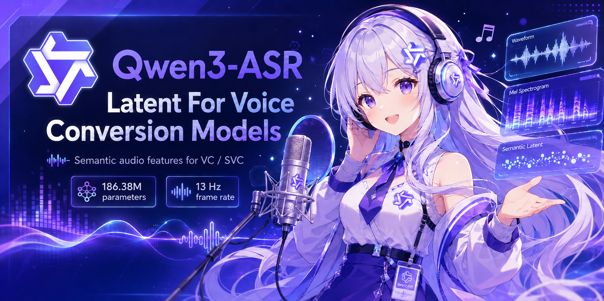

<picture>
  <source width="100%" srcset="./assets/banner_1.png" />
  
</picture>

<h1 align="center">Qwen3-ASR Latents for Voice Conversion Models</h1>

<p align="center">
    <a href="https://huggingface.co/Qwen/Qwen3-ASR-0.6B"></a>
    <a href="https://github.com/QwenLM/Qwen3-ASR"></a>
</p>

## Overview

This repository provides a lightweight wrapper of [Qwen3-ASR](https://github.com/QwenLM/Qwen3-ASR) for extracting semantic audio features that can be used in voice conversion (VC) and singing voice conversion (SVC) pipelines.

In our SVC experiments, we found that these features preserve articulation and expressiveness better than the commonly used ContentVec and Whisper features.

> **Note**
> This project does **not** train or release a new ASR model.
> The pretrained model weights are from [Qwen/Qwen3-ASR-0.6B](https://huggingface.co/Qwen/Qwen3-ASR-0.6B), developed by the Qwen team.
> This repository only modifies/adapts parts of the original Qwen3-ASR code to expose intermediate latent features for VC/SVC usage.

### Model Information

| Attribute | Details |
| :--- | :--- |
| **Base Model** | [Qwen/Qwen3-ASR-0.6B](https://huggingface.co/Qwen/Qwen3-ASR-0.6B) |
| **Parameters** | 186.38M |
| **Extraction Frame Rate** | 13 Hz |

We also fix the eager attention backend issue as mentioned in [#103](https://github.com/QwenLM/Qwen3-ASR/pull/103). We have verified the latents on several long audio samples, and the transcription results are correct.

## Install requirements

### 1. Install PyTorch

Follow the official [PyTorch installation guide](https://pytorch.org/get-started/locally/) to install PyTorch on your system.

### 2. Install Python Dependencies

After installing PyTorch, install the required dependencies:

```bash
pip install -r requirements.txt
```

## Download pretrained model

Download [pretrained model](https://huggingface.co/Qwen/Qwen3-ASR-0.6B) under `./pretrained/qwen3_asr` dir:

```text
# Download through ModelScope (recommended for users in Mainland China)
pip install -U modelscope
modelscope download --model Qwen/Qwen3-ASR-0.6B --local_dir ./pretrained/qwen3_asr

# Download through Hugging Face
pip install -U "huggingface_hub[cli]"
huggingface-cli download Qwen/Qwen3-ASR-0.6B --local-dir ./pretrained/qwen3_asr
```

## Python Usage

Extracting semantic embeddings from your audio files:

```python
import torch
import torchaudio

from qwen_asr.wrapper import Qwen3ASRWrapper

device = 'cuda' if torch.cuda.is_available() else 'cpu'
model = Qwen3ASRWrapper("pretrained/qwen3_asr").to(device)

audio_path = 'examples/audios/test1.wav'
audio, sample_rate = torchaudio.load(audio_path)

embedding = model.forward(audio, sample_rate)
print('Embedding shape: ', embedding.shape)
```


## (Optional) Verify Embedding Consistency

To prevent embedding drift when upgrading `transformers`, `torch`, or other dependencies, we provide two verification scripts.

1. **Generate reference embeddings:** Run the script below to save baseline embedding outputs to `examples/features/*.pt`.

```bash
python tools/save_example_features.py
```

We have already extracted the embeddings, you can skip this step..

2. **Verify consistency**: After updating your environment, compare the new outputs against your saved references to ensure reproducibility:

```bash
python tools/compare_example_features.py
```

## License

This project is licensed under the Apache License 2.0.

This repository contains wrapper code and adapted components based on Qwen3-ASR for extracting intermediate latent features for VC/SVC usage. The original Qwen3-ASR model and pretrained weights are developed by the Qwen team and are licensed under Apache License 2.0.

This project does not train or release a new ASR model. Users should download the pretrained weights from the official Qwen/Qwen3-ASR-0.6B release.
